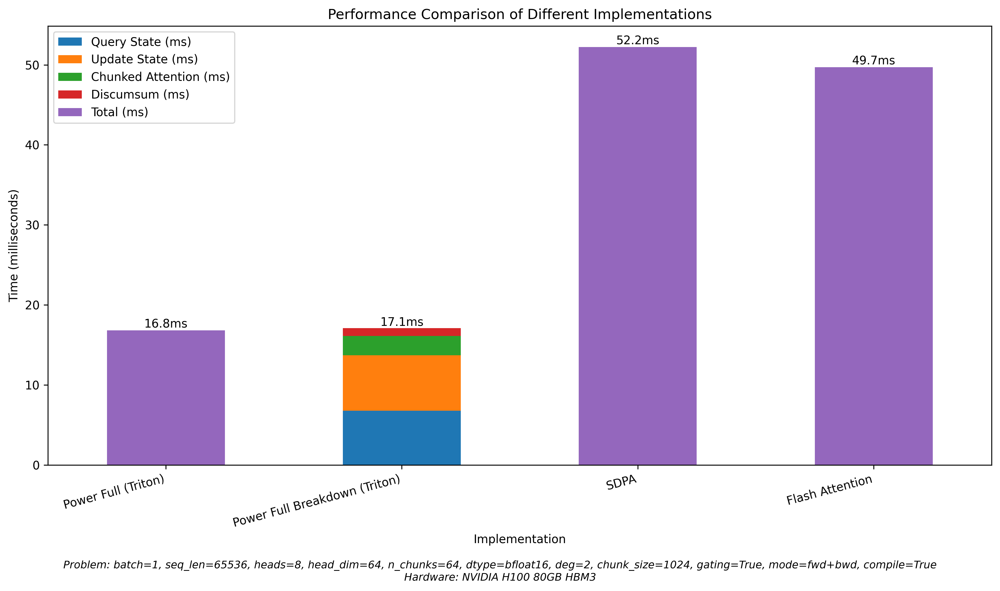
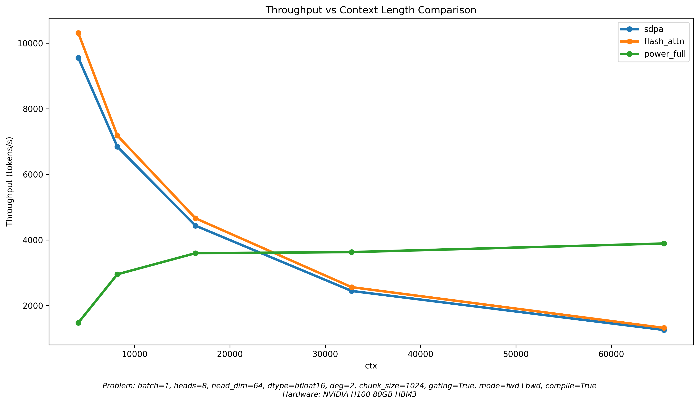

# Benchmark

```bash
python -m perf.benchmark fwd+bwd
```
Running the above command will produce 2 plots: single-problem benchmark and context-scaling benchmark.

## Single Problem Benchmark
To understand the performance of power-attention, we compare the execution time of power-attention on a particular problem size (defined by batch, seqlen, heads, head_dim, and chunk_size), versus that of flash-attention on the same problem.



For example, the above shows that for a problem with batch 1, seqlen 65536, heads 8, head_dim 64, flash-attention and torch's scaled-dot-product-attention function both takes around 50ms to compute the output on H100, whereas power-attention takes 16.8ms, resulting a **3x** throughput improvement.

To run benchmark on a different problem, refer to `benchmark.py` for different options one can specify.


## Throughput by Context

We can also vary the context size to get a better idea of the relative throughput of power-attention and flash-attention.



This shows that as context size increases, the throughput of power-attention stays constant while flash-attention drops due to its quadratic cost.
